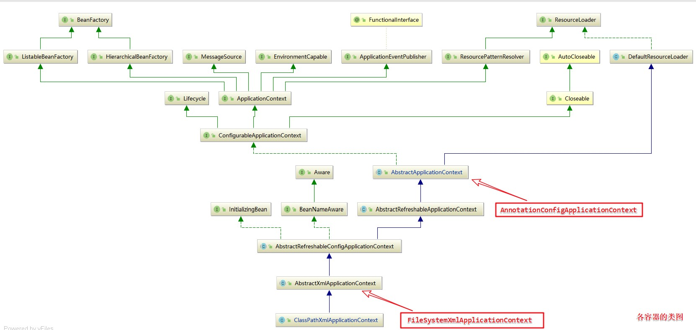

## Spring Ioc容器

  IoC Inversion of Control
  IoC容器控制了对象，进行管理等操作。

  本module将用源码讲解IoC是怎么管理对象的，
  如何通过BeanDefinition生成bean对象的，以及Spring IoC容器中Bean的生命周期的

### Spring IoC实现方式

   1. XML方式实现
主要是在一个xml配置文件中声明bean节点
```xml
<bean id="user" class="com.gqzdev.ioc.bean.User"></bean>
```

   2. 通过注解方式实现
需要使用@Component、@Service、@Controller、@Repository、@Bean等注解
需要指定包扫描
- 注解方式

  @Configuration
  @ComponentScan

- 在xml文件中指定
```xml
    <!--spring管理的bean路径-->
    <context:component-scan bean="com.gqzdev.ioc.bean"></context>
```


### Spring IoC实现原理解析

IoC实现过程

- 初始化父容器AbstractApplicationContext
- 设置资源文件的位置setConfigLocations
- 使用核心方法refresh() 

```java
//ClassPathXmlApplicationContext
public ClassPathXmlApplicationContext(
		String[] configLocations, boolean refresh, @Nullable ApplicationContext parent)
			throws BeansException {
    super(parent);
    setConfigLocations(configLocations);
    if (refresh) {        
        refresh();
    }
}

//FileSystemXmlApplicationContext
public FileSystemXmlApplicationContext(
		String[] configLocations, boolean refresh, @Nullable ApplicationContext parent)
			throws BeansException {
    super(parent);
    setConfigLocations(configLocations);
    if (refresh) {
        refresh();
    }
}

//AnnotationConfigApplicationContext
public AnnotationConfigApplicationContext(Class<?>... annotatedClasses) {
    //调用父类构造方法
    this();
    register(annotatedClasses);
    refresh();
}
```

这几个ApplicationContext的实现



下面重点分析refresh()方法，其方法是在`ConfigurableApplicationContext`接口中定义的；`ConfigurableApplicationContext`的基类是BeanFactory；

AbstractApplicationContext类中实现了ConfigurableApplicationContext接口并重写refresh方法

```java
/**
 @Author：ganquanzhong
 @Date： 2019/12/30 23:09
重点分析AbstractApplicationContext中的refresh方法；
	AbstractApplicationContext.refresh()方法是一个模版方法，定义了一些需要执行的步骤。
	并不是实现了所有的逻辑，只是充当了一个模版，由其子类实现更多个性化逻辑
	最核心的两个步骤是
	1.创建BeanFactory
		ConfigurableListableBeanFactory beanFactory = obtainFreshBeanFactory();
	2.实例化Bean
		finishBeanFactoryInitialization(beanFactory);
*/
@Override
public void refresh() throws BeansException, IllegalStateException {
    synchronized (this.startupShutdownMonitor) {
        // Prepare this context for refreshing.
        prepareRefresh();

        // Tell the subclass to refresh the internal bean factory.
        //告诉子类刷新内部bean工厂  创建BeanFactory
        ConfigurableListableBeanFactory beanFactory = obtainFreshBeanFactory();

        // Prepare the bean factory for use in this context.准备在这种情况下使用的bean工厂
        prepareBeanFactory(beanFactory);

        try {
            // Allows post-processing of the bean factory in context subclasses.
            //允许在上下文子类中对bean工厂进行后处理  完成了扫描
            postProcessBeanFactory(beanFactory);

            // Invoke factory processors registered as beans in the context.
            //调用工厂处理器 注册bean  完成扫描  代理
            invokeBeanFactoryPostProcessors(beanFactory);

            // Register bean processors that intercept bean creation.
            registerBeanPostProcessors(beanFactory);

            // Initialize message source for this context.
            initMessageSource();

            // Initialize event multicaster for this context.
            initApplicationEventMulticaster();

            // Initialize other special beans in specific context subclasses.
            onRefresh();

            // Check for listener beans and register them.
            registerListeners();

            // 在创建BeanFactory的过程中，BeanDefinition注册到了BeanFactory中的一个ConCurretHashMap对象中
            // 以BeanName为key，BeanDefinition为value
            // Instantiate all remaining (non-lazy-init) singletons. 实例化所有剩余的（非延迟初始化）单例。
            finishBeanFactoryInitialization(beanFactory);

            // Last step: publish corresponding event.  最后一步：发布相应的事件。
            finishRefresh();
        }

        catch (BeansException ex) {
            if (logger.isWarnEnabled()) {
                logger.warn("Exception encountered during context initialization - " +
                            "cancelling refresh attempt: " + ex);
            }

            // Destroy already created singletons to avoid dangling resources.
            destroyBeans();

            // Reset 'active' flag.
            cancelRefresh(ex);

            // Propagate exception to caller.
            throw ex;
        }

        finally {
            // Reset common introspection caches in Spring's core, since we
            // might not ever need metadata for singleton beans anymore...
            resetCommonCaches();
        }
    }
}
```

在refresh()方法中最核心的两步如下：

1. 创建BeanFactory

```java
ConfigurableListableBeanFactory beanFactory = obtainFreshBeanFactory();
```

2. 实例化Bean

```java
finishBeanFactoryInitialization(beanFactory);		
```

:bulb:这两个过程是很复杂的，后期有时间再详细分析。主要是在调试的过程中分析每一步骤的变化，并结合代码分析。

## Bean的生命周期

| Spring Bean生命周期各阶段 | 相关接口及方法    |
|:-- |:-- |
| 1. Bean自身方法    | Bean本身业务的方法<br />配置文件中init-method和destroy-method指定的方法 |
| 2. Bean生命周期接口方法   | InitiailizingBean接口 <br />DiposableBean接口 <br />BeanNameAware接口<br />ApplicationContextAware接口<br />BeanFactoryAware接口 <br />其他 |
| 3. 容器级别生命周期接口方法 <br />（一般称为“后处理器”） |  InstantiationAwareBeanPostProcessor接口实现 </br> BeanPostPorcessor 接口实现   |
| 4. 工厂后处理器接口方法 <br />（也可归纳为容器级别）  | AspectJWeavingEnable<br />ConfigurationClassPostProcessor<br /> CustomeAutowireConfigurer等 |